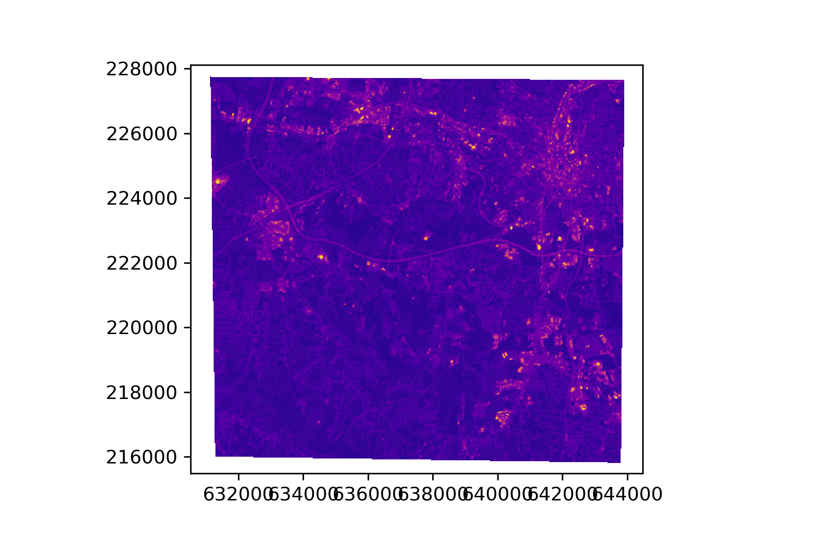
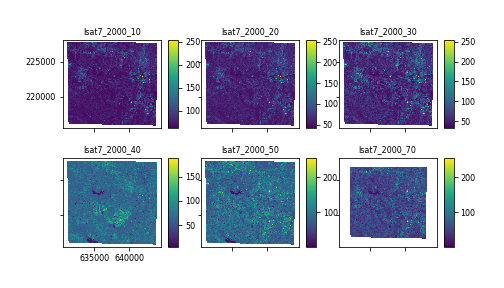

Plotting
========

Basic plotting has been added to as a method to RasterLayer and Raster options.
More controls on plotting will be added in the future. Currently you can set a
matplotlib cmap for each RasterLayer using the ``RasterLayer.cmap`` attribute.

Plot a single RasterLayer:
::

    # set RasterLayer color table
    stack.lsat7_2000_10.cmap = 'plasma'

    # plot a single layer
    fig, ax = plt.subplots()
    stack.lsat7_2000_10.plot(ax=ax)
    plt.show()

    Raster of stacked nc data

Plot all RasterLayers in a Raster object:
::

    stack.plot()

    Raster of stacked nc data
